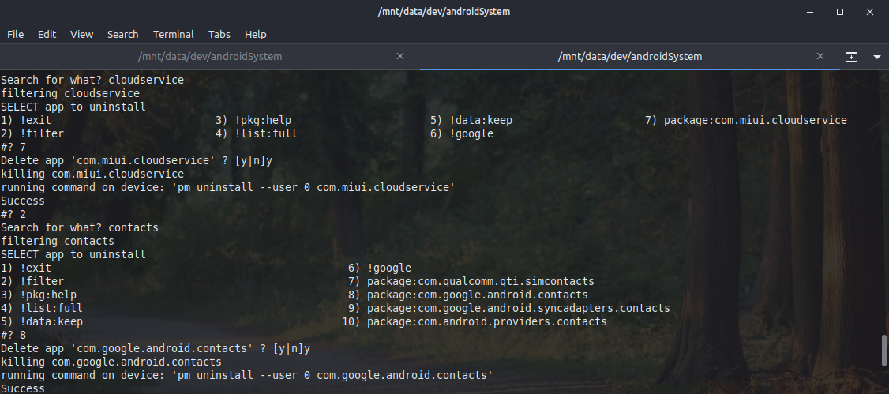

# Android App Uninstaller

Allows to uninstall protected apps from your Android device, 
such as bloatware from your vendor or a myriad of pre-installed google apps.

No rooting is required, just the official Android Debugger support is used.
Be carefull though, this script is able to remove sytem critical apps.

More details on this approach can be found here: 
https://forum.xda-developers.com/t/debloating-miui-without-root-access-manual-method.4149707/

## Pre-requisites

A remote debugging sessions to the target device:
https://medium.com/android-news/wireless-debugging-through-adb-in-android-using-wifi-965f7edd163a

### Wired (USB)

1. Connect classically, via USB. Check connection via `adb devices`.
1. Accept debug prompt on target device.

### Wireless

1. Enable remote debugging for target device `adb tcpip 5555`.
1. Get to know the IP address of the remote device.
1. Establish connection via IP:Port `adb connect 192.168.1.X:5555`.
1. Check connections via `adb devices`.

## Replay

The uninstaller writes a log on removed apps. 
If you have multiple devices, you may re-execute a removal plan as simple as that:

1. adb push uninstall.log /storage/emulated/0/Downloads
1. adb shell
1. /system/bin/sh /storage/emulated/0/Downloads/uninstall.log

